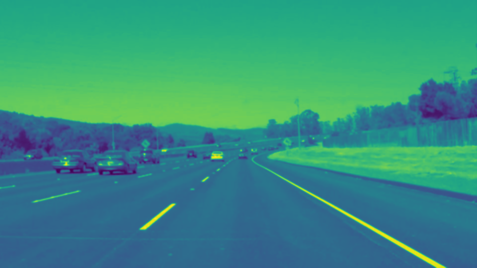
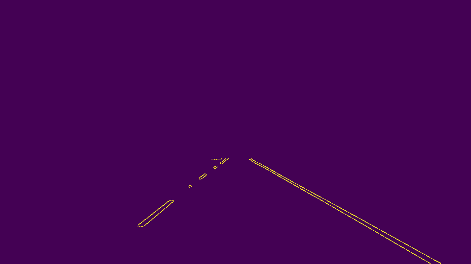
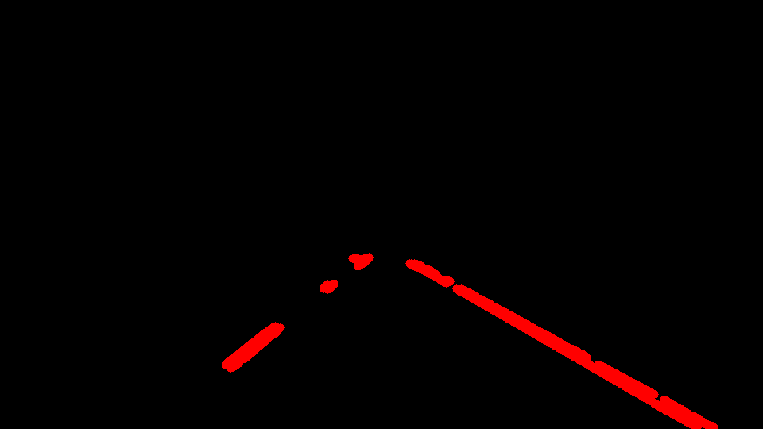
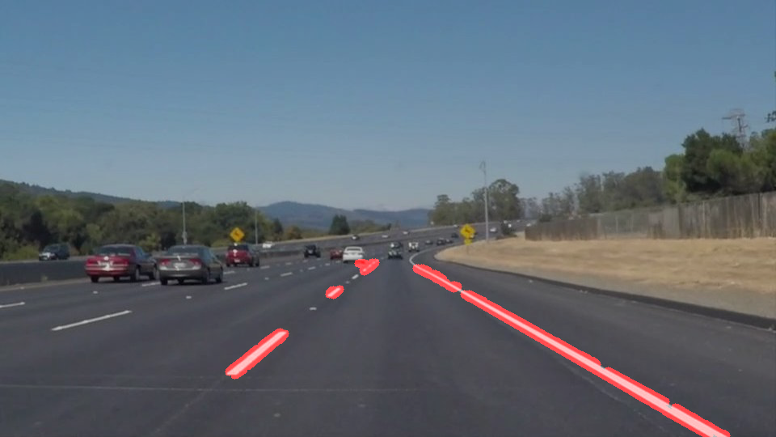
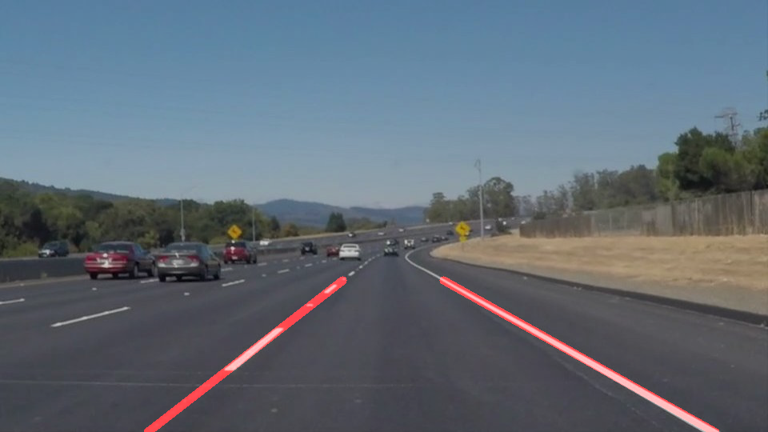

# **Finding Lane Lines on the Road** 

**Finding Lane Lines on the Road**

The goals / steps of this project are the following:
* Make a pipeline that finds lane lines on the road
* Reflect on your work in a written report

Here is an example of a lanes on a road from car's camera perpective and end goal of project as marked Lanes.
Top picture is camera shot and Below is Lane marked ("Painted") by 
postprocessed openCV functions in python. 

The Project work (code, results and this report) can be found [Here!](https://github.com/atul799/CarND-LaneLines-P1)

[//]: # (Image References)

## 1. Description of pipeline  and modification of the draw_lines() function

### Pipeline
The Pipeline is a function macro of steps required to postprocess images or videos (series of images).
The steps implemented and results are listed below:
* **Step1: convert to grey scale** ( in challenge video a masked image is use where in yellow and white pixels are extracted instead of greysacling), openCV function used is cv2.cvtColor.

* **Step2: gaussian blur** (remove noise from the image), openCV function used is cv2.GaussianBlur

* **Step3: canny edge detenction** (standard edge detection algorithm, autothreshold detection not explored),openCV function used is  cv2.Canny

* **Step4: define vertices of polygon to mask** (define area of image and generate a mask in the area which will be used to mark lane).

* **Step5: Hough transform**  (Hough transform is used to generate lines or in general shapes from image), openCv function used is cv2.HoughLinesP

* **Step6: draw lines with a blank image** (output of Hough transform is series of x-y pairs that is used to draw lane marking using cv2.line function)

* **Step7: overlap orig image with Hough trans and drawn_line img**, openCV function cv2.addWeighted is used which transposes black and line drawn image over original image

### Modifications to draw_lines function
The pipeline is tested on image and video examples provided with the Project files . 
Here are the fine tuning that needs to be done:
* Finding area of interest to mask depends on the perspective (camera position), few trials were done to find optimum mask area.
* Thickness of lane marking is chosen as 10 pxs.
* Hough transform lines are non-continous for broken lane markers (See above)
* In order to draw continous lane markings, I modified the draw_lines function by separating the lines based on slope into left and right bin. I also stored the the correspong x,y cords for each bin, based on x,y pairs, I generated a linear fit using np.polyfit function which return slope and intercepts. Using the slope and intercepts I generated the top x,y and bottom x,y for left and right lanes.
**Here is the outcome of new draw_lines function**

### The Jupyter notebook of project P1.ipynb and html copy can be found in the github repository

### 2. Potential shortcomings with current pipeline
* There are a few issues assumptions in the method used to mark Lanes in the current approach.
    * The camera position is fixed  w.r.t. road. In the challenge video the camera postion changes hence car's hood overlaps lane markings.
    * The Vehicle maintains a minimum distance to other vehicles in the lane, more explicitly there is no (at least white or yellow) vehicle in the area of interest.
    * Lane colors are White or yellow and images are clear (i.e. weather conditions are good and clear gradient of color or separation exist between lanes and sorroundings)
    * Both lane lines are present on road
	
In the videos the slope of the lane chages as vehicle moves this induces flicker on lane marking.A rolling average method is introduced in the draw_lines function to smoothen the slope and average slope of last 20 frames are used.

### SolidWhiteRight video

### SolidyellowLeft video

In the challenge video the lane direction changes quite a bit,left lane is close to divider hence the pipeline described above doesn't work (edges detected and area of interest mask is not able to separate lane from divider), there are also shadows on the lane and probably camera position changes (hood is exposed more towards end of the video). For the challenge video, a new mask is created by first extracting white pixels from image, then extracting yellow pixels and combining the 2 pictures.
This method helps much better extraction of lanes.

### Challenge video

### 3. Suggest possible improvements to your pipeline

* Setting Canny threshold automatically
* Using (white and yellow) color masks instead of greyscale image to identify edges seems to be better approach.
* The approach in this project depends on area of interest mask and quality of image, based on camera angle and type, some fine tuning will always be required and producing reliable  results is tedious.

##### The Result images can be found in directory: test_images_output on the github repository for this project
##### The Result videos can be found in directory: test_videos_output on the github repository for this project

